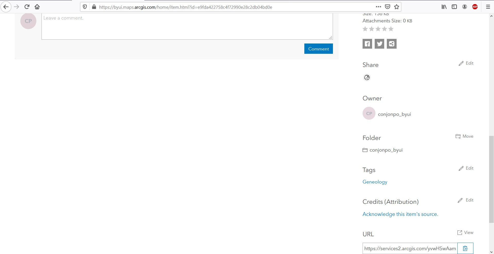
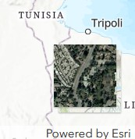
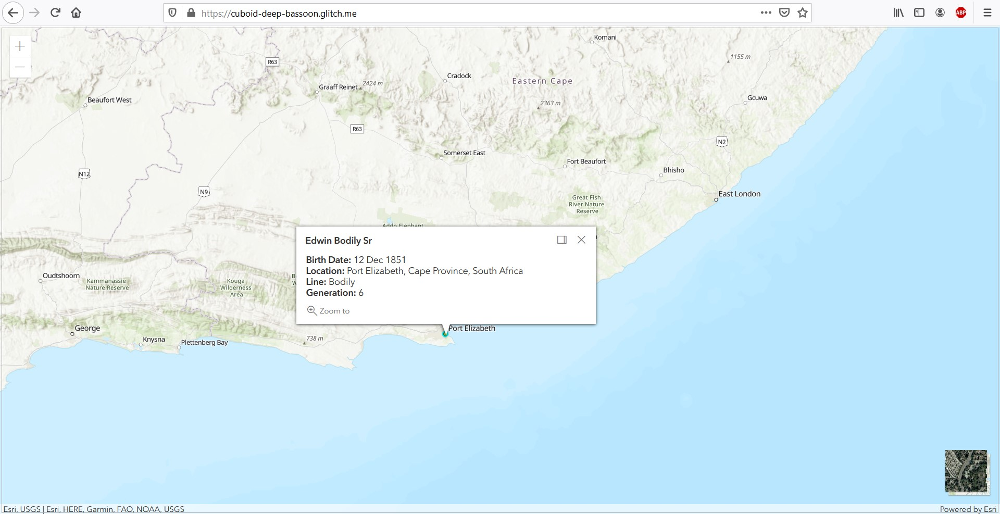

# GIS Mapping

** Link to the [website and final product](https://cuboid-deep-bassoon.glitch.me/). ** 

## Overview

The purpose of this website is to demonstrate what can be done with the ArcGIS API for JavaScript. I have made a map of the birth places mine and my wife's ancestors back seven generations in ArcGIS Pro for another class, but I wanted this map to be on a website and pop-ups to appear when you click on a marker. Since I am a GIS Technician, this project interested me since I want to know what can be done with interactive maps on the web. This is will be a useful skill for work.

## Development Environment

* Glitch
* ArcGIS Online
* ArcGIS Pro

Glitch is an online service where HTML, CSS and JavaScript can be written and preview and can be connected to GitHub (though I had trouble connecting to GitHub, I had to download my HTML file and then upload it to this repository). ArcGIS Pro is what I made the map in originally and it was uploaded to ArcGIS Online. A license for both ArcGIS Online and ArcGIS Pro is required to complete this the way I did. I acquired a license through my university.

## Execution

The first step is to [follow this link](https://developers.arcgis.com/labs/javascript/create-a-starter-app/) and put in the basic JavaScript code into an HTML file on Glitch. Your website should show just a blank map.

The next step is to add data to your map. The tutorial shows you how to add some data that Esri made, but I added my own data. If you want to add your own data, you will first need to create a map in ArcGIS Online and then use the URL at the bottom of the Overview page, as seen in the screenshot below:


This is the code I used to add layers to the map:
```
var HayAncestors = new FeatureLayer({
     url: "https://services2.arcgis.com/yvwHSwAamLDJNzPK/arcgis/rest/services/Family_History_Map/FeatureServer",
     });

var ConAncestors = new FeatureLayer({
     url: "https://services2.arcgis.com/yvwHSwAamLDJNzPK/arcgis/rest/services/Family_History_Map/FeatureServer/1",
     });
```

This code goes into the script made in the first step.

The next step is to add a way to switch basemaps. I decided to use a basemap toggle using this code:
```
var basemapToggle = new BasemapToggle({
  view: view,
  nextBasemap: "satellite"
});
```

We also need to add this code so the basemap toggle will appear on the website:

```
view.ui.add(basemapToggle, "bottom-right");
```

The basemap toggle should be in a the bottom right corner of your map and look like this:



Next, we are going to add popups to the code so that when a user clicks on a feature it will give more information on that feature. Here is the code needed to do that:

```
var popupNames = {
  title: "{Name}",
  content:
  "<b>Birth Date:</b> {BirthDate}<br><b>Location:</b> {Location}<br><b>Line:</b> {Line}<br><b>Generation:</b> {Generation}"
};
```

We also need to add this line of code into the feature variable:
```
popupTemplate: popupNames
```

Here's what the popup should look like:



Lastly, we will need to add symbology to our points. I decided to change the color of the points based on which line of mine and my wife's ancestry each ancestor is from. Here's the code for that:
```
        function createFillSymbol(value, color) {
          return {
            value: value,
            symbol: {
              color: color,
              type: "simple-marker",
              size: "6px"
            }
          };
        }

        var ConAncestorsRenderer = {
          type: "unique-value",
          field: "Line",
          uniqueValueInfos: [
            createFillSymbol("Pohlsander", "#FFFFFF"),
            createFillSymbol("Haws", "#C1C0C0"),
            createFillSymbol("Conner", "#000000"),
            createFillSymbol("Hankins", "#D00000")
          ]
        };
        
        var HayAncestorsRenderer = {
          type: "unique-value",
          field: "Line",
          uniqueValueInfos: [
            createFillSymbol("Walker", "#00D2FF"),
            createFillSymbol("Bell", "#47DD8E"),
            createFillSymbol("Olsen", "#FBA500"),
            createFillSymbol("Bodily", "#EAE009")
          ]
        };
```

Make sure to update your feature variable with this code so the symbology will display correctly:

```
        var HayAncestors = new FeatureLayer({
          url:
            "https://services2.arcgis.com/yvwHSwAamLDJNzPK/arcgis/rest/services/Family_History_Map/FeatureServer",
          outFields: ["Name", "BirthDate", "Location", "Line", "Generation"],
          popupTemplate: popupNames,
          renderer: HayAncestorsRenderer
        });

        var ConAncestors = new FeatureLayer({
          url:
            "https://services2.arcgis.com/yvwHSwAamLDJNzPK/arcgis/rest/services/Family_History_Map/FeatureServer/1",
          outFields: ["Name", "BirthDate", "Location", "Line", "Generation"],
          popupTemplate: popupNames,
          renderer: ConAncestorsRenderer
        });
```

## Helpful Links

* [https://developers.arcgis.com/labs/](https://developers.arcgis.com/labs/)
* [https://glitch.com/](https://glitch.com/)
